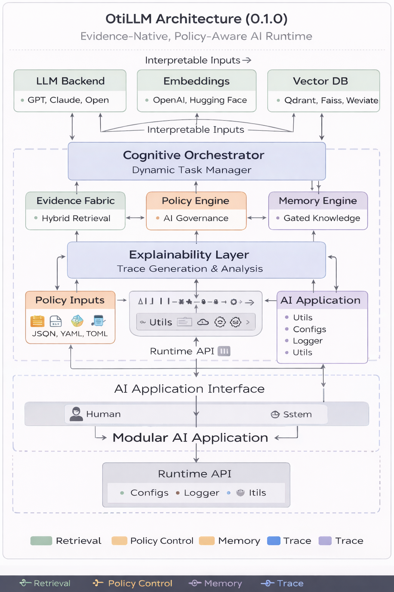

# OtiLLM 0.1.0

Evidence-Native, Policy-Aware AI Runtime for Reliable AI Systems

---

## Overview

OtiLLM 0.1.0 is the founding open-source release of OtiLLM, a next-generation AI runtime architecture designed to improve the reliability, governance, and explainability of modern AI systems.

While large language models and retrieval systems have advanced significantly, their real-world deployment often exposes fundamental weaknesses. OtiLLM addresses these by restructuring how AI systems operate internally, introducing a runtime in which evidence, policy, memory, and explainability are tightly integrated and enforced.

This repository provides a working, extensible implementation of that architecture for researchers, engineers, and organisations building high-trust AI systems.

---

## Architecture Diagram



Figure 1: OtiLLM 0.1.0 Architecture — An Evidence-Native, Policy-Aware AI Runtime integrating retrieval, governance, memory, and explainability into a unified execution pipeline.

The OtiLLM architecture introduces a structured runtime model designed to improve the reliability and governance of AI systems. 

At the core of the system is the Cognitive Orchestrator, which coordinates the interaction between the Evidence Fabric, Policy Engine, and Memory Engine. The Evidence Fabric performs hybrid retrieval using multiple scoring signals, including semantic relevance, keyword overlap, temporal context, and source trust. The Policy Engine enforces governance constraints by evaluating whether a request or action satisfies predefined safety and compliance rules. The Memory Engine implements gated storage, ensuring that only high-quality, policy-compliant, and novel information is retained.

The Explainability Layer provides a transparent trace of system behaviour, capturing evidence sources, confidence levels, and policy decisions. This enables auditability and supports deployment in high-trust environments.

The architecture is designed to support multimodal inputs and modular AI applications, allowing integration with language models, embedding systems, and vector databases. By enforcing a structured flow from input to output, OtiLLM shifts AI system design from loosely coupled pipelines to a controlled, evidence-driven runtime framework.

---

## The Problem OtiLLM Solves

Modern AI systems frequently fail in high-stakes environments due to:

- answers generated without sufficient or verifiable evidence
- weak or non-existent policy enforcement
- uncontrolled or low-quality memory accumulation
- limited visibility into reasoning and decision processes
- unreliable behaviour in long-running or agent-based workflows

These limitations are not purely model problems. They are system design problems.

---

## The OtiLLM Approach

OtiLLM introduces a structured runtime in which every meaningful output follows a controlled lifecycle:

Input → Evidence → Reason → Verify → Align → Act → Explain

This replaces loosely coupled pipelines with a bounded, auditable, and evidence-driven execution model.

---

## How OtiLLM Differs from Existing Approaches

### Standard LLM Pipelines
- rely heavily on prompt engineering
- limited visibility into reasoning
- no explicit evidence validation
- no runtime governance

### Traditional RAG Systems
- improve factual grounding
- but often rely on naive retrieval
- lack policy awareness
- limited explainability
- no structured memory control

### Agent-Based Systems
- powerful but often unbounded
- difficult to control or audit
- prone to unsafe or inconsistent behaviour

### OtiLLM

OtiLLM combines the strengths of these approaches while addressing their weaknesses:

- evidence is explicitly retrieved, scored, and validated
- policies are enforced before execution
- memory is gated and quality-controlled
- outputs are traceable and explainable
- system behaviour is bounded and auditable

---

## Key Components

### Evidence Fabric

A hybrid retrieval layer that evaluates information using multiple signals:

- semantic relevance
- keyword overlap
- temporal freshness
- graph-aware signals
- source trust (provenance)

This enables more reliable evidence selection than standard retrieval pipelines.

### Policy Engine

A runtime governance layer that evaluates whether a request or action is allowed before execution.

This enables safer deployment in regulated and high-trust environments.

### Memory Engine

A gated memory system that only stores information when it is:

- sufficiently high quality
- policy-compliant
- novel

This prevents uncontrolled accumulation and improves long-term reliability.

### Cognitive Orchestrator

The central coordination layer that integrates retrieval, validation, scoring, and generation.

It ensures that outputs are only produced when evidence and confidence thresholds are satisfied.

### Explainability Layer

A built-in tracing system that provides visibility into how each response is generated, including:

- retrieved sources
- evidence scores
- confidence estimation
- policy decisions
- execution outcomes
- memory updates

---

## Architecture Overview

OtiLLM is organised as a structured runtime pipeline:

Multimodal Input
Perception Layer
Evidence Fabric
Cognitive Orchestrator
Policy Engine
Memory Engine
Generator / Action Layer
Explainability Trace
Output

This design enables controlled, interpretable, and verifiable AI behaviour.

---

## What This Release Includes

This initial release provides:

- a modular Python package implementing the OtiLLM runtime
- evidence ingestion and hybrid retrieval
- policy-aware request handling
- memory-gated storage logic
- explainability trace generation
- working examples demonstrating usage
- a test suite for core components
- packaging configuration for distribution

---

## What This Release Does Not Claim

OtiLLM 0.1.0 is a foundational runtime framework.

It does not claim:

- state-of-the-art benchmark performance
- a fully trained large-scale foundation model
- production-grade distributed infrastructure
- complete multimodal training pipelines

Instead, it establishes the architectural and implementation foundation required for those capabilities.

---

## Installation

Clone the repository:

```bash
git clone https://github.com/YOUR_GITHUB_USERNAME/OtiLLM.git
cd OtiLLM
```

Install locally:

```bash
pip install -e .
```

For development:

```bash
pip install -e .[dev]
```

---

## Quick Start

```python
from otillm import OtiLLM

model = OtiLLM()

model.add_evidence(
    content="Retrieval-Augmented Generation reduces hallucination by grounding outputs in external knowledge.",
    source="rag_reference",
    trust_score=0.9
)

model.add_evidence(
    content="Policy-aware AI systems are essential in regulated environments such as healthcare and finance.",
    source="governance_reference",
    trust_score=0.95
)

response = model.query("Why is policy-aware retrieval important?")

print(response.answer)
print(model.explain(response))
```

---

## Example Output Behaviour

The system produces:

1. A grounded response based on retrieved evidence
2. A detailed trace explaining:

- which sources were used
- how they were scored
- confidence level
- evidence sufficiency
- policy decision
- execution outcome
- whether memory was updated

This makes OtiLLM suitable for applications where transparency and accountability are required.

---

## Use Cases

OtiLLM is particularly suited for:

- enterprise-grade RAG systems
- explainable AI assistants
- policy-aware AI copilots
- regulated decision-support systems
- multimodal intelligence applications
- auditable AI workflows

---

## Repository Structure

```text
OtiLLM/
├── otillm/
│   ├── core/
│   ├── evidence/
│   ├── multimodal/
│   ├── explainability/
│   └── utils/
├── tests/
├── examples/
├── README.md
├── LICENSE
├── pyproject.toml
└── setup.py
```

---

## Running Tests

```bash
pytest
```

---

## Roadmap

Future versions will extend this release with:

- vector database integration
- pluggable LLM backends
- benchmark evaluation framework
- CI/CD pipelines
- enhanced multimodal processing
- domain-specific policy modules
- advanced memory and retrieval optimisation

---

## Research Positioning

OtiLLM represents a shift from model-centric AI design to runtime-centric AI systems.

Rather than relying solely on model scale, OtiLLM focuses on:

- structured evidence grounding
- policy-aware execution
- controlled memory evolution
- built-in explainability

The framework supports ongoing research into reliable and governed AI systems.

---

## Author

Oti Edema
AI/ML Research Engineer and Data Scientist

LinkedIn: https://www.linkedin.com/in/oti-e-34838485/

---

## Contributing

Contributions are welcome.

Areas of interest include:

- retrieval system improvements
- multimodal extensions
- policy and governance modules
- benchmarking and evaluation
- documentation and examples

---

## License

This project is released under the MIT License.
